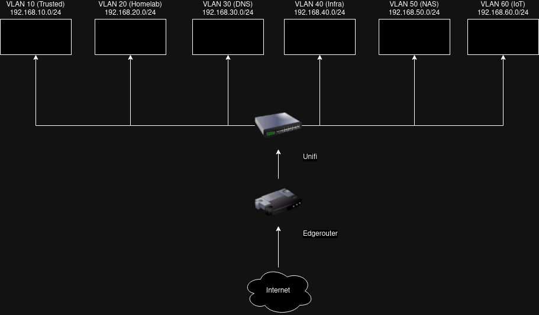

# Infra for managed resources

- [Overview](#overview)
- [Directory structure](#directory-structure)
- [Hardware](#hardware)
- [Network](#network)

## Overview

This repository holds the bootstrapping and configuration of various cloud and on-prem hosted solutions related to my digital infrastructure. The purpose of this project is to keep and maintain a blueprint of how different resources are setup and utilise off-the-shelf tooling with maintainability, security, upgradeability, and governance in mind.

If applicable, resources shall be provisioned and managed through Terraform. Terraform is vendor agnostic, which enables the exporting and importing of data between resources regardless of which vendor they are.

If a Terraform provider is not available, and Terraform's data type is neither an option, Ansible is the second preferred choice of configuration.

## Directory structure

```
📂 infra
├─📁 .github       # Github actions workflows, repostory settings, and dependabot settings.
├─📁 ansible       # Ansible playbooks.
├─📁 dockerfiles   # Dockerfiles management for tooling.
├─📁 documentation # Source of custom documentation for various resources.
├─📁 images        # Source of images supporting documentation.
├─📁 k8s           # WIP location for anything Kubernetes.
├─📁 scrips        # Any ad-hoc or one-off scripts.
└─📁 terraform     # Terraform configuration.
```

_Set hostname on Fedora with https://docs.fedoraproject.org/en-US/quick-docs/changing-hostname/_

## hardware

[See here](./documentation/hardware.md)

## Network

[CIDR ranges](./documentation/networks.md)


